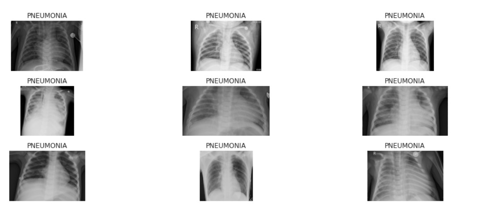
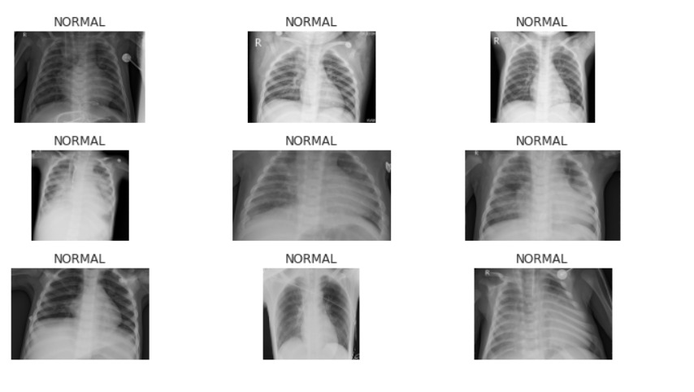
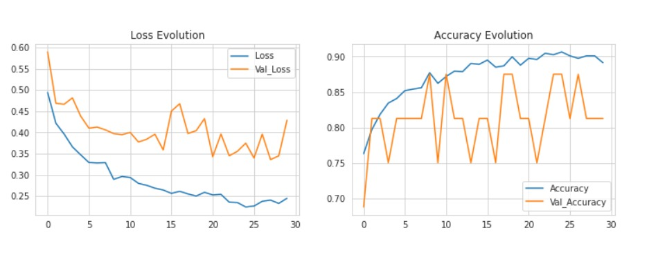
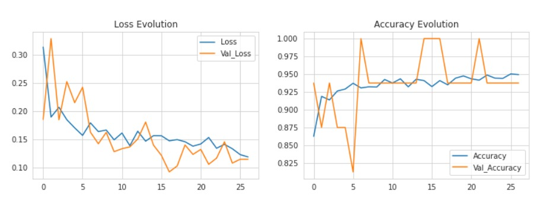
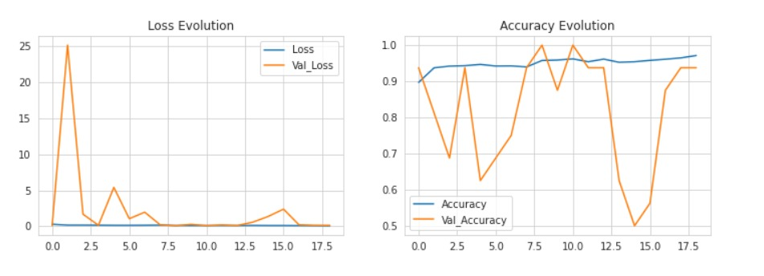

  

# Pneumonia Detection using Transfer Learning

## Approach

Pneumonia detection is commonly predicted using basic CNN models. However , the accuracy of these state of the art models is pretty low.
On the other hand, our approach of using Transfer learning, that is, by using VGG-19 and ResNet50, we can get a much better accuracy. 

## Project

Our project consists of 3 approaches:
* VGG-19 Model
* ResNet50 Model
* ResNet50 Model after Fine-Tuning parameters

## Dataset

Dataset consists of images of 2 classes of chest X-ray images:
1. Diseased
2. Normal

 &ensp;&ensp;&ensp;&ensp;&ensp;&ensp;&ensp;&ensp;&ensp;
 &ensp;&ensp;&ensp;&ensp;&ensp;&ensp;&ensp;&ensp;&ensp; 

The dataset can be accessed from the `Data` Folder.

## Model Results

### VGG-19

 &ensp;&ensp;&ensp;&ensp;&ensp;&ensp;&ensp;&ensp;&ensp;

### ResNet50

 &ensp;&ensp;&ensp;&ensp;&ensp;&ensp;&ensp;&ensp;&ensp;

### ResNet50 - Fine Tuned

 &ensp;&ensp;&ensp;&ensp;&ensp;&ensp;&ensp;&ensp;&ensp;

## How to Use

* Clone the repository using :

        $ git clone https://github.com/rishusiva/Pneumonia_Detection
                
* Enter the directory using:

        $ cd Pneumonia_Detection/
      
* Install the requirements using:

        $ pip install -r requirements.txt

* Run the demo notebook 
        
## Results

* VGG-19 : 85%
* ResNet50 : 91%
* ResNet50 Tuned : 95%

<h2 align= "left"><b>Project Maintainer(s)</b></h2>

<table>
<tr align="center">
  
  <td>
  
Rishikesh S

</td>

  </table>

## Contribution 

Contributions are always welcome! You can contribute to this project in the following way:
- [ ] Increasing the accuracy 
- [ ] Bug fixes if any
- [ ] Creating an application

Do check out the <a href="https://github.com/rishusiva/Pose-Network/blob/main/Docs/Contribution.md">documentation</a> for Contribution Guidelines.
